# EduAI 系统图表

本文档包含项目的架构图、数据流图和活动图。

---

## 1. 系统架构图

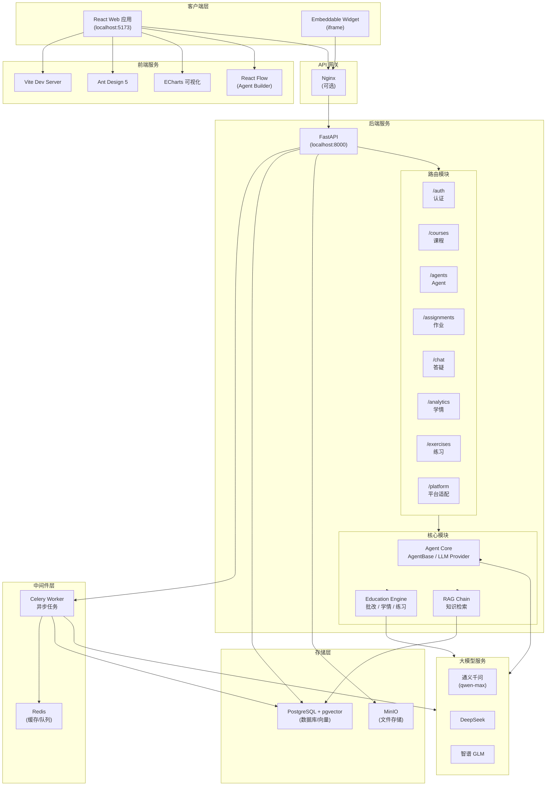

---

## 2. 技术架构图

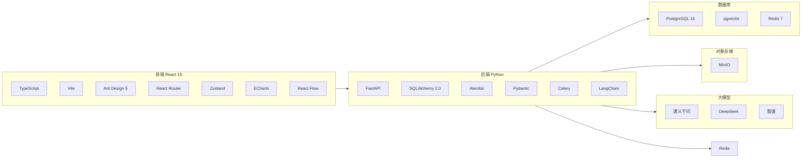

---

## 3. 核心数据流图 (DFD)

### 3.1 智能答疑数据流

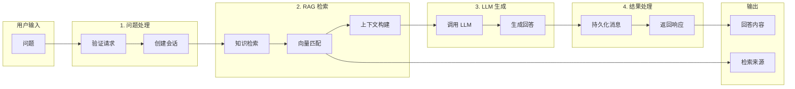

### 3.2 作业批改数据流

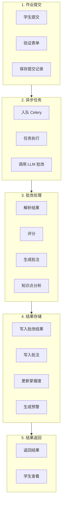

### 3.3 练习生成数据流

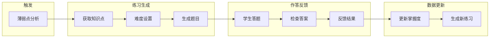

---

## 4. 活动图

### 4.1 学生使用主流程

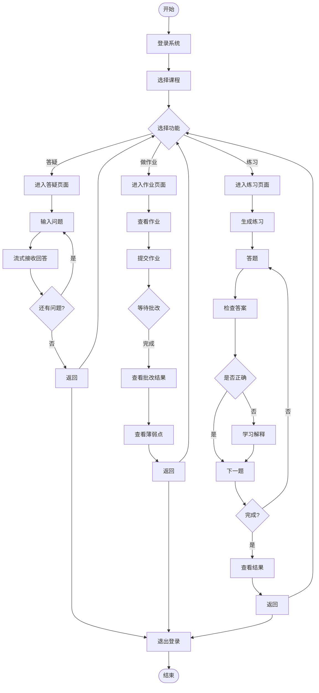

### 4.2 教师创建 Agent 流程

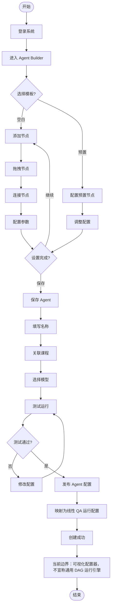

### 4.3 平台嵌入启动流程

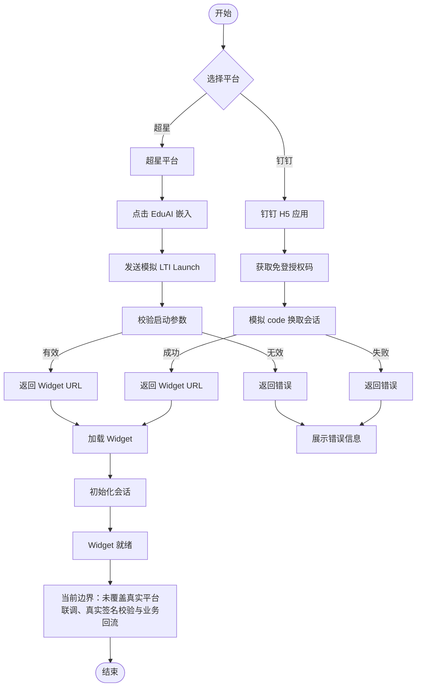

---

## 5. 模块交互时序图

### 5.1 答疑时序图

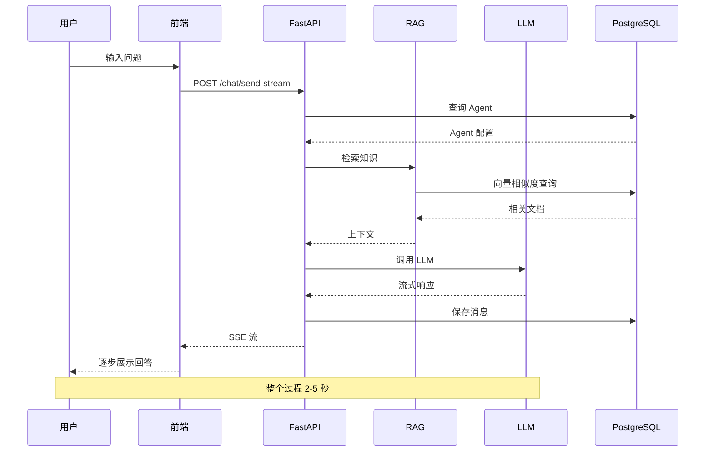

### 5.2 作业批改时序图

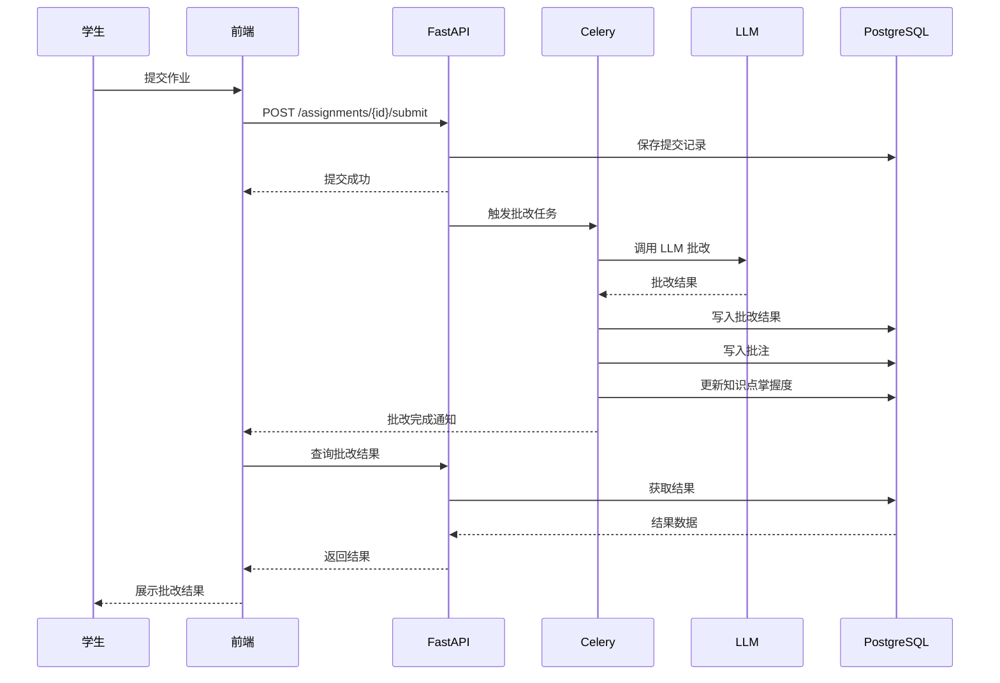

### 5.3 Agent Builder 保存时序图

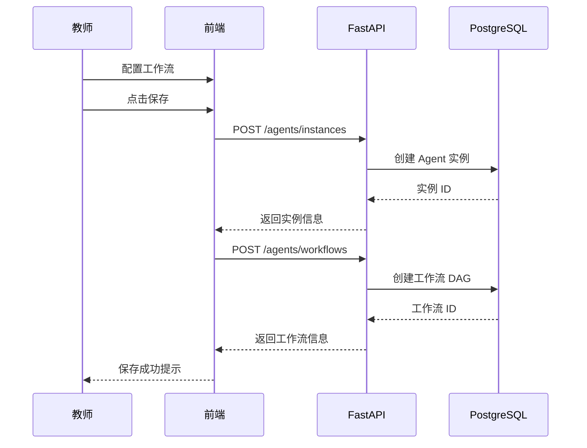

---

## 6. 数据库 ER 图（核心实体）

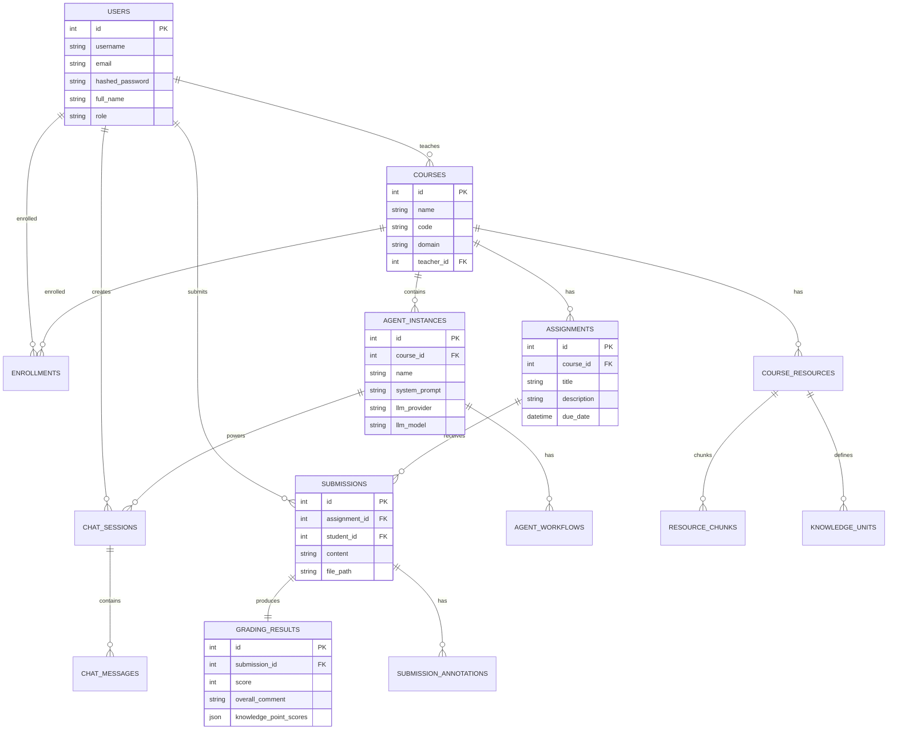

---

## 7. 部署架构图

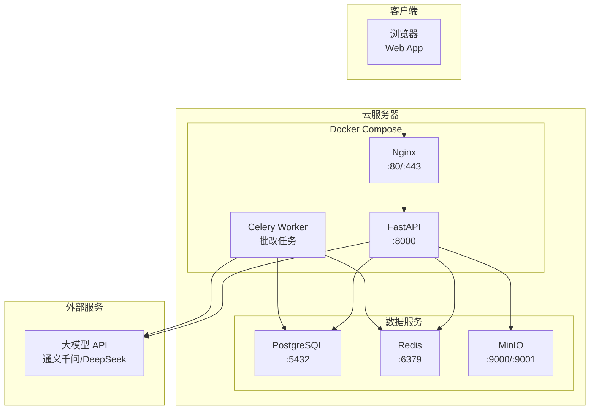

---
