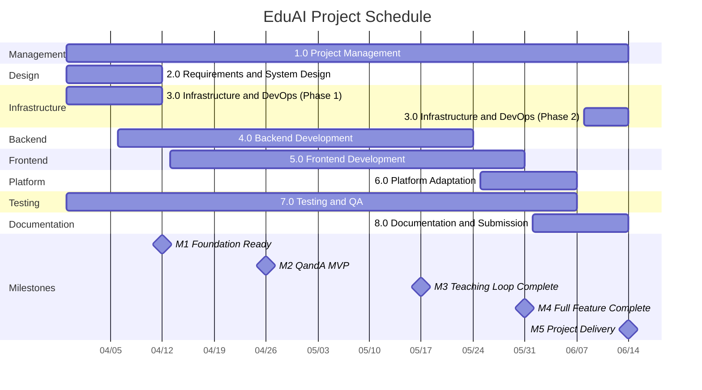

```mermaid
gantt 
    title EduAI Project Schedule
    dateFormat YYYY-MM-DD
    axisFormat %m/%d
    tickInterval 1week

    section Management
    1.0 Project Management          :1_0, 2026-03-30, 2026-06-14

    section Design
    2.0 Requirements and System Design :2_0, 2026-03-30, 2026-04-12

    section Infrastructure
    3.0 Infrastructure and DevOps (Phase 1) :3_0a, 2026-03-30, 2026-04-12
    3.0 Infrastructure and DevOps (Phase 2) :3_0b, 2026-06-08, 2026-06-14

    section Backend
    4.0 Backend Development         :4_0, 2026-04-06, 2026-05-24

    section Frontend
    5.0 Frontend Development        :5_0, 2026-04-13, 2026-05-31

    section Platform
    6.0 Platform Adaptation         :6_0, 2026-05-25, 2026-06-07

    section Testing
    7.0 Testing and QA                :7_0, 2026-03-30, 2026-06-07

    section Documentation
    8.0 Documentation and Submission  :8_0, 2026-06-01, 2026-06-14

    section Milestones
    M1 Foundation Ready    :milestone, m1, 2026-04-12, 0d
    M2 QandA MVP             :milestone, m2, 2026-04-26, 0d
    M3 Teaching Loop Complete :milestone, m3, 2026-05-17, 0d
    M4 Full Feature Complete  :milestone, m4, 2026-05-31, 0d
    M5 Project Delivery    :milestone, m5, 2026-06-14, 0d
```