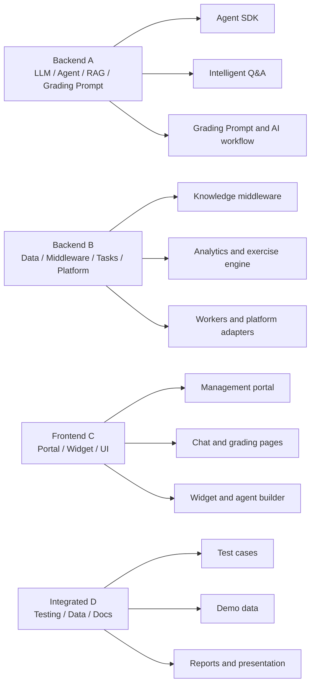
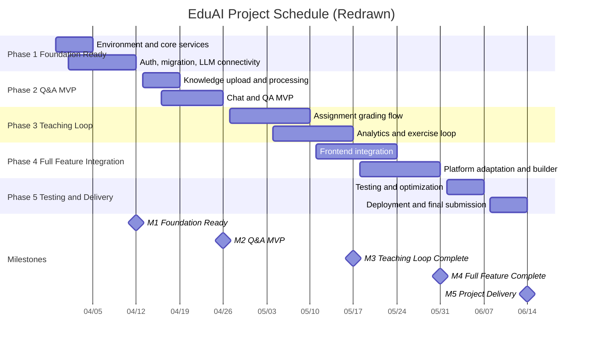
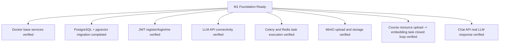

# EduAI RBS / WBS / Schedule Diagrams

本文件用于重绘项目的 `RBS`、`WBS` 和 `Schedule` 图示，面向课程作业与阶段汇报使用。

## 1. Requirement Breakdown Structure (RBS)

```mermaid
flowchart TB
    R0[Project Goal and Solution<br/>Build EduAI as an embeddable cross-course AI teaching platform]

    R0 --> RF[Functional Requirements]
    R0 --> RN[Non-Functional Requirements]
    R0 --> RC[Constraints]

    RF --> R1[Requirement 1<br/>Unified AI Agent Capability]
    R1 --> R11[Function<br/>Agent SDK]
    R11 --> R111[Sub-function<br/>AgentBase and role templates]
    R111 --> R1111[Feature<br/>Reusable QA / Grading / Exercise agent templates]
    R1 --> R12[Function<br/>LLM Integration]
    R12 --> R121[Sub-function<br/>Multi-provider model access]

    RF --> R2[Requirement 2<br/>Knowledge Processing and Retrieval]
    R2 --> R21[Function<br/>Knowledge Middleware]
    R21 --> R211[Sub-function<br/>Document ingestion]
    R211 --> R2111[Feature<br/>PDF / Word / PPT content extraction]
    R21 --> R212[Sub-function<br/>Vector storage and indexing]
    R21 --> R213[Sub-function<br/>Hybrid retrieval]

    RF --> R3[Requirement 3<br/>Teaching Interaction and Q&A]
    R3 --> R31[Function<br/>Intelligent Q&A]
    R31 --> R311[Sub-function<br/>Multi-turn dialogue]
    R311 --> R3111[Feature<br/>Session-based conversation continuity]
    R31 --> R312[Sub-function<br/>Course-context answering]

    RF --> R4[Requirement 4<br/>Assignment Grading and Annotation]
    R4 --> R41[Function<br/>Assignment Grading]
    R41 --> R411[Sub-function<br/>Multi-modal grading]
    R4 --> R42[Function<br/>Annotation Feedback]
    R42 --> R421[Sub-function<br/>Teacher-style inline comments]
    R421 --> R4211[Feature<br/>Structured annotation output for feedback rendering]

    RF --> R5[Requirement 5<br/>Learning Analytics and Exercise Support]
    R5 --> R51[Function<br/>Learning Analytics]
    R51 --> R511[Sub-function<br/>Mastery analysis and warning]
    R5 --> R52[Function<br/>Personalized Exercise Generation]
    R52 --> R521[Sub-function<br/>Weak-point targeted exercise support]
    R521 --> R5211[Feature<br/>Assess-grade-practice closed-loop support]

    RF --> R6[Requirement 6<br/>Platform Embedding and Management]
    R6 --> R61[Function<br/>Platform Adaptation]
    R61 --> R611[Sub-function<br/>Chaoxing and DingTalk embedding]
    R6 --> R62[Function<br/>Agent Visual Builder]
    R62 --> R621[Sub-function<br/>Teacher-side visual configuration]
    R621 --> R6211[Feature<br/>Drag-and-drop style agent customization]

    RN --> R71[Requirement N1<br/>Performance and Accuracy]
    R71 --> R711[Function<br/>Concurrent access support]
    R71 --> R712[Function<br/>Q&A and grading quality targets]
    R712 --> R7121[Feature<br/>Q&A and grading accuracy >= 95%]

    RN --> R72[Requirement N2<br/>Security and Architecture]
    R72 --> R721[Function<br/>Role-based access control]
    R72 --> R722[Function<br/>Reusable modular architecture]
    R722 --> R7221[Feature<br/>Cross-course reusable SDK architecture]

    RC --> R81[Constraint 1<br/>Primary LLM]
    R81 --> R811[Feature<br/>Tongyi Qianwen as the primary model]
    RC --> R82[Constraint 2<br/>Platform Scope]
    R82 --> R821[Feature<br/>Simulated platform integration only]
    RC --> R83[Constraint 3<br/>Timeline]
    R83 --> R831[Feature<br/>Project delivery by 2026-06-14]
```

## 2. Work Breakdown Structure (WBS) - Part 1

```mermaid
flowchart TB
    W0[Project WBS]

    W0 --> W1[1.0 Project Management]
    W1 --> W11[Subfunction<br/>Project coordination]
    W11 --> W111[Activity<br/>Initiation and tracking]
    W111 --> W1111[Task<br/>Complete charter and weekly progress control]
    W11 --> W112[Activity<br/>Risk handling]
    W112 --> W1121[Task<br/>Resolve blockers and align team]

    W0 --> W2[2.0 Requirements and System Design]
    W2 --> W21[Subfunction<br/>Requirement definition]
    W21 --> W211[Activity<br/>Draft RBS and confirm scope]
    W211 --> W2111[Task<br/>Finalize requirement set]
    W2 --> W22[Subfunction<br/>Architecture and schema design]
    W22 --> W221[Activity<br/>Design system architecture]
    W221 --> W2211[Task<br/>Confirm module boundaries]
    W22 --> W222[Activity<br/>Design database schema]
    W222 --> W2221[Task<br/>Confirm data model and relations]
    W2 --> W23[Subfunction<br/>Interface and UI design]
    W23 --> W231[Activity<br/>Define API contracts]
    W231 --> W2311[Task<br/>Write route specifications]
    W23 --> W232[Activity<br/>Draw page wireframes]
    W232 --> W2321[Task<br/>Prepare UI sketches]

    W0 --> W3[3.0 Infrastructure and DevOps]
    W3 --> W31[Subfunction<br/>Local environment setup]
    W31 --> W311[Activity<br/>Configure Docker Compose]
    W311 --> W3111[Task<br/>Start postgres, redis and minio]
    W31 --> W312[Activity<br/>Run Alembic migration]
    W312 --> W3121[Task<br/>Generate and apply schema]
    W3 --> W32[Subfunction<br/>Runtime services]
    W32 --> W321[Activity<br/>Configure Celery and Redis]
    W321 --> W3211[Task<br/>Verify task queue execution]
    W32 --> W322[Activity<br/>Configure MinIO]
    W322 --> W3221[Task<br/>Verify object storage access]
    W3 --> W33[Subfunction<br/>Deployment setup]
    W33 --> W331[Activity<br/>Cloud deployment and Nginx]
    W331 --> W3311[Task<br/>Prepare deployment script and reverse proxy]

    W0 --> W4[4.0 Backend Development]
    W4 --> W41[Subfunction<br/>Core infrastructure]
    W41 --> W411[Activity<br/>Auth and data models]
    W411 --> W4111[Task<br/>JWT auth and user roles]
    W41 --> W412[Activity<br/>Seed data preparation]
    W412 --> W4121[Task<br/>Prepare initial users and course data]
    W4 --> W42[Subfunction<br/>Agent and AI capability]
    W42 --> W421[Activity<br/>Agent SDK and LLM integration]
    W421 --> W4211[Task<br/>Implement AgentBase and provider layer]
    W4 --> W43[Subfunction<br/>Knowledge middleware]
    W43 --> W431[Activity<br/>Document parsing and embedding]
    W431 --> W4311[Task<br/>Store chunks and vectors]
    W4 --> W44[Subfunction<br/>Teaching intelligence engine]
    W44 --> W441[Activity<br/>Grading, analytics and exercise logic]
    W441 --> W4411[Task<br/>Build grading and analytics flow]
    W4 --> W45[Subfunction<br/>RESTful API routes]
    W45 --> W451[Activity<br/>Implement route groups]
    W451 --> W4511[Task<br/>Deliver 8 API route groups]
```

## 3. Work Breakdown Structure (WBS) - Part 2

```mermaid
flowchart TB
    W0B[Project WBS]

    W0B --> W5[5.0 Frontend Development]
    W5 --> W51[Subfunction<br/>Shared frontend structure]
    W51 --> W511[Activity<br/>Shared components, layout and UI support]
    W511 --> W5111[Task<br/>Initialize project and common state]
    W5 --> W52[Subfunction<br/>Core teaching pages]
    W52 --> W521[Activity<br/>Login, dashboard, course, chat and page integration]
    W521 --> W5211[Task<br/>Implement core course workflow pages]
    W5 --> W53[Subfunction<br/>Advanced interaction pages]
    W53 --> W531[Activity<br/>Assignment, analytics, exercises, builder and demo support]
    W531 --> W5311[Task<br/>Implement advanced teaching pages]
    W53 --> W532[Activity<br/>Embeddable widget]
    W532 --> W5321[Task<br/>Build iframe-compatible widget]

    W0B --> W6[6.0 Platform Adaptation]
    W6 --> W61[Subfunction<br/>Chaoxing adaptation]
    W61 --> W611[Activity<br/>Adapter simulation, embedding specification and technical documentation]
    W611 --> W6111[Task<br/>Prepare Chaoxing embedding spec]
    W6 --> W62[Subfunction<br/>DingTalk adaptation]
    W62 --> W621[Activity<br/>Adapter simulation, embedding specification and technical documentation]
    W621 --> W6211[Task<br/>Prepare DingTalk embedding spec]

    W0B --> W7[7.0 Testing and QA]
    W7 --> W71[Subfunction<br/>Functional testing]
    W71 --> W711[Activity<br/>Unit test design and execution]
    W711 --> W7111[Task<br/>Verify backend API and core logic]
    W7 --> W72[Subfunction<br/>Quality validation]
    W72 --> W721[Activity<br/>API, accuracy and performance validation]
    W721 --> W7211[Task<br/>Validate Q&A, grading and concurrency targets]
    W7 --> W73[Subfunction<br/>System integration testing]
    W73 --> W731[Activity<br/>End-to-end integration and scenario testing]
    W731 --> W7311[Task<br/>Verify closed-loop business scenarios]

    W0B --> W8[8.0 Documentation and Submission]
    W8 --> W81[Subfunction<br/>Technical documentation]
    W81 --> W811[Activity<br/>Project report writing and iterative technical documentation]
    W811 --> W8111[Task<br/>Maintain report and architecture description throughout the project]
    W8 --> W82[Subfunction<br/>Presentation materials]
    W82 --> W821[Activity<br/>Prepare PPT and demo video]
    W821 --> W8211[Task<br/>Record and edit demo materials]
    W8 --> W83[Subfunction<br/>Final submission package]
    W83 --> W831[Activity<br/>Assemble submission package]
    W831 --> W8311[Task<br/>Complete final delivery package]
```

## 4. Estimated Working Hours

### 4.1 Module-Level Summary

| WBS | Module | Estimated Hours | Primary Responsible |
| :--- | :--- | ---: | :--- |
| 1.0 | Project Management | 24 | All members |
| 2.0 | Requirements and System Design | 40 | All members |
| 3.0 | Infrastructure and DevOps | 32 | Backend A / Backend B |
| 4.0 | Backend Development | 120 | Backend A / Backend B |
| 5.0 | Frontend Development | 96 | Frontend C / Integrated D |
| 6.0 | Platform Adaptation | 16 | Integrated D / Backend B |
| 7.0 | Testing and QA | 40 | Integrated D (lead) / All members |
| 8.0 | Documentation and Submission | 32 | Integrated D / All members |
|  | **Total Working Hours** | **400** |  |

### 4.2 Task-Level Estimation for Scheduling

| WBS | Task / Work Package | Estimated Hours | Suggested Owner |
| :--- | :--- | ---: | :--- |
| 1.1 | Complete charter and weekly progress control | 16 | All members |
| 1.2 | Resolve blockers and align team | 8 | All members |
| 2.1 | Finalize requirement set | 8 | All members |
| 2.2 | Confirm module boundaries | 12 | All members |
| 2.3 | Confirm data model and relations | 8 | Backend A / Backend B |
| 2.4 | Write route specifications | 8 | Backend A / Backend B |
| 2.5 | Prepare UI sketches | 4 | Frontend C |
| 3.1 | Start postgres, redis and minio | 8 | Backend A |
| 3.2 | Generate and apply schema | 4 | Backend A |
| 3.3 | Verify task queue execution | 8 | Backend B |
| 3.4 | Verify object storage access | 4 | Backend B |
| 3.5 | Prepare deployment script and reverse proxy | 8 | Backend A / Backend B |
| 4.1 | JWT auth and user roles | 10 | Backend A |
| 4.2 | Prepare initial users and course data | 10 | Backend B |
| 4.3 | Implement AgentBase and provider layer | 16 | Backend A |
| 4.4 | Implement QA / grading / exercise agent capability | 16 | Backend A |
| 4.5 | Store chunks and vectors | 12 | Backend B |
| 4.6 | Build grading and analytics flow | 16 | Backend A / Backend B |
| 4.7 | Deliver Auth / Courses APIs | 6 | Backend B |
| 4.8 | Deliver Agents / Assignments APIs | 6 | Backend A / Backend B |
| 4.9 | Deliver Chat / Analytics APIs | 6 | Backend A / Backend B |
| 4.10 | Deliver Exercises / Platform APIs | 6 | Backend B |
| 4.11 | Resource upload and async processing loop | 8 | Backend B |
| 4.12 | Q&A closed-loop integration | 8 | Backend A |
| 5.1 | Initialize project and common state | 8 | Frontend C / Integrated D |
| 5.2 | Implement login, dashboard, course and chat pages | 32 | Frontend C / Integrated D |
| 5.3 | Implement assignment, analytics, exercises and builder pages | 40 | Frontend C |
| 5.4 | Build iframe-compatible widget | 16 | Frontend C / Integrated D |
| 6.1 | Prepare Chaoxing embedding spec | 8 | Integrated D |
| 6.2 | Prepare DingTalk embedding spec | 8 | Integrated D |
| 7.1 | Unit test design and execution for backend/API logic | 14 | Integrated D |
| 7.2 | API, Q&A, grading and concurrency validation | 14 | Integrated D |
| 7.3 | End-to-end integration and closed-loop scenario verification | 12 | All members |
| 8.1 | Project report writing and iterative update | 12 | All members |
| 8.2 | Record and edit demo materials | 8 | Integrated D |
| 8.3 | Complete final delivery package | 12 | Integrated D |

## 5. Responsibility Mapping

## 6. Project Schedule and Milestones

## 7. Current Progress Alignment

