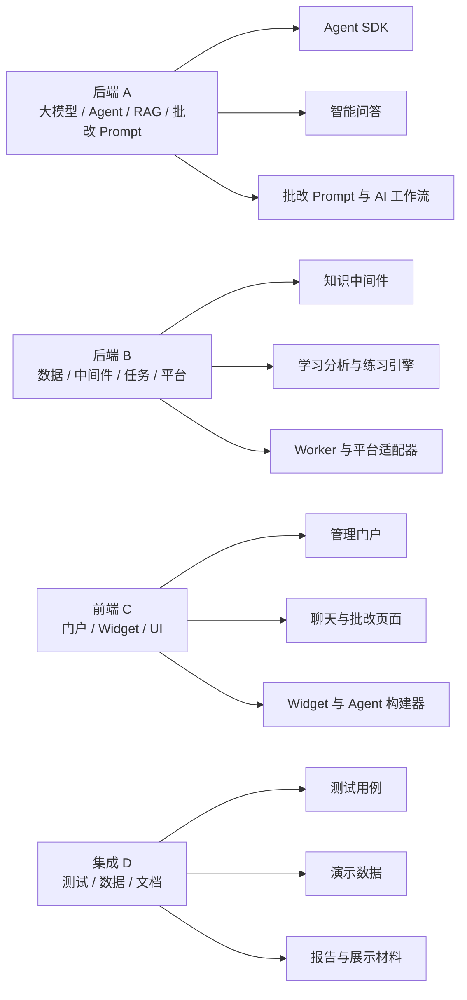
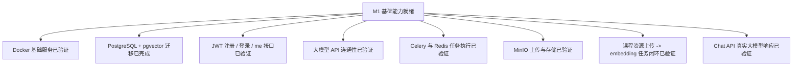

# EduAI RBS / WBS / 进度计划图

本文档用于重绘项目的 `RBS`、`WBS` 和 `Schedule` 图示，面向课程作业与阶段汇报使用。

## 1. 需求分解结构（RBS）

```mermaid
flowchart TB
    R0[项目目标与解决方案<br/>将 EduAI 建设为可嵌入多课程场景的 AI 教学平台]

    R0 --> RF[功能性需求]
    R0 --> RN[非功能性需求]
    R0 --> RC[约束条件]

    RF --> R1[需求 1<br/>统一 AI Agent 能力]
    R1 --> R11[功能<br/>Agent SDK]
    R11 --> R111[子功能<br/>AgentBase 与角色模板]
    R111 --> R1111[特性<br/>可复用的问答 / 批改 / 练习 Agent 模板]
    R1 --> R12[功能<br/>大模型集成]
    R12 --> R121[子功能<br/>多供应商模型接入]
    R1 --> R13[功能<br/>课程 Agent 场景]
    R13 --> R131[子功能<br/>教师侧与学生侧课程 Agent]
    R131 --> R1311[特性<br/>同一课程知识库下按角色提供不同入口]

    RF --> R2[需求 2<br/>知识处理与检索]
    R2 --> R21[功能<br/>知识中间件]
    R21 --> R211[子功能<br/>文档摄取]
    R211 --> R2111[特性<br/>PDF / Word / PPT 内容提取]
    R21 --> R212[子功能<br/>向量存储与索引]
    R21 --> R213[子功能<br/>混合检索]
    R21 --> R214[子功能<br/>课程级知识隔离]
    R214 --> R2141[特性<br/>资源、chunk、embedding、Agent、chat session 绑定 course_id]

    RF --> R3[需求 3<br/>教学互动与问答]
    R3 --> R31[功能<br/>智能问答]
    R31 --> R311[子功能<br/>多轮对话]
    R311 --> R3111[特性<br/>基于会话的上下文连续性]
    R31 --> R312[子功能<br/>结合课程上下文回答]
    R31 --> R313[子功能<br/>聊天记录持久化]
    R313 --> R3131[特性<br/>按课程和用户保存会话历史]

    RF --> R4[需求 4<br/>作业批改与批注]
    R4 --> R41[功能<br/>作业批改]
    R41 --> R411[子功能<br/>多模态批改]
    R41 --> R412[子功能<br/>参考答案与评分标准]
    R412 --> R4121[特性<br/>支持教师在作业中附加参考答案和 rubric]
    R4 --> R42[功能<br/>批注反馈]
    R42 --> R421[子功能<br/>教师风格的行内评语]
    R421 --> R4211[特性<br/>用于反馈渲染的结构化批注输出]

    RF --> R5[需求 5<br/>学习分析与练习支持]
    R5 --> R51[功能<br/>学习分析]
    R51 --> R511[子功能<br/>掌握度分析与预警]
    R5 --> R52[功能<br/>个性化练习生成]
    R52 --> R521[子功能<br/>面向薄弱点的练习支持]
    R521 --> R5211[特性<br/>测评-批改-练习闭环支持]

    RF --> R6[需求 6<br/>平台嵌入与管理]
    R6 --> R61[功能<br/>平台适配]
    R61 --> R611[子功能<br/>超星与钉钉嵌入]
    R61 --> R612[子功能<br/>Widget 嵌入]
    R6 --> R62[功能<br/>Agent 可视化构建器]
    R62 --> R621[子功能<br/>课程 Agent 可视化配置]
    R621 --> R6211[特性<br/>拖拽式 Agent 定制]

    RN --> R71[非功能需求 N1<br/>性能与准确性]
    R71 --> R711[功能<br/>并发访问支持]
    R71 --> R712[功能<br/>问答与批改质量目标]
    R712 --> R7121[特性<br/>问答与批改准确率 >= 90%]
    R71 --> R713[功能<br/>测试覆盖]
    R713 --> R7131[特性<br/>课程隔离、批量题集、异常场景、性能与并发测试]

    RN --> R72[非功能需求 N2<br/>安全与架构]
    R72 --> R721[功能<br/>基于角色的访问控制]
    R72 --> R722[功能<br/>可复用的模块化架构]
    R722 --> R7221[特性<br/>跨课程复用的 SDK 架构]
    R72 --> R723[功能<br/>异常处理与用户反馈]
    R723 --> R7231[特性<br/>上传失败、worker 失败、LLM 失败、无资料、无 Agent 明确提示]

    RC --> R81[约束 1<br/>主要大模型]
    R81 --> R811[特性<br/>以通义千问作为主要模型]
    RC --> R82[约束 2<br/>平台范围]
    R82 --> R821[特性<br/>仅实现模拟平台集成]
    RC --> R83[约束 3<br/>时间范围]
    R83 --> R831[特性<br/>项目于 2026-06-14 前交付]
```

### 1.1 评审后 RBS 补充说明

本次评审后，RBS 图已在原有结构上补充以下约束和场景，作为后续里程碑的修订依据：

- 在“需求 1：统一 AI Agent 能力”下补充课程 Agent 使用场景：Agent 以课程为单位绑定资料、知识点和上下文；教师侧用于检查作业知识点、校验参考答案、生成练习建议和总结学生薄弱点，学生侧用于课程答疑、复习和练习反馈。
- 在“需求 2：知识处理与检索”下强化课程级知识隔离：课程资源、chunk、embedding、Agent 和 chat session 都需要绑定 `course_id`，RAG 检索不得跨课程混用资料。
- 在“非功能需求 N1：性能与准确性”下补充课程隔离测试、批量题集评测、性能与并发测试。
- 在“非功能需求 N2：安全与架构”下补充异常处理和用户错误提示要求，包括上传失败、worker 失败、LLM 调用失败、课程无资料和课程无 Agent 等场景。

## 2. 工作分解结构（WBS）- 第 1 部分

```mermaid
flowchart TB
    W0[Project WBS]

    W0 --> W1[1.0 项目管理]
    W1 --> W11[Subfunction<br/>项目协调]
    W11 --> W111[Activity<br/>进度跟踪与团队协作]
    W111 --> W1111[Task<br/>1.1 项目协调与进度跟踪]
    W1 --> W12[Subfunction<br/>风险与计划管理]
    W12 --> W121[Activity<br/>风险处理]
    W121 --> W1211[Task<br/>1.2 风险与阻塞处理]
    W12 --> W122[Activity<br/>评审反馈与计划修正]
    W122 --> W1221[Task<br/>1.3 工时统计、评审反馈跟踪与计划修正]

    W0 --> W2[2.0 需求与系统设计]
    W2 --> W21[Subfunction<br/>需求定义]
    W21 --> W211[Activity<br/>更新 RBS / WBS / schedule]
    W211 --> W2111[Task<br/>2.1 RBS / WBS / schedule 更新]
    W21 --> W212[Activity<br/>定义课程 Agent 场景]
    W212 --> W2121[Task<br/>2.4 课程 Agent 使用场景定义]
    W2 --> W22[Subfunction<br/>架构与知识隔离设计]
    W22 --> W221[Activity<br/>确认系统架构与模块边界]
    W221 --> W2211[Task<br/>2.2 系统架构与模块边界确认]
    W22 --> W222[Activity<br/>设计课程知识库隔离]
    W222 --> W2221[Task<br/>2.5 课程知识库隔离设计]
    W2 --> W23[Subfunction<br/>数据模型与接口设计]
    W23 --> W231[Activity<br/>设计数据模型、API 与前端交互]
    W231 --> W2311[Task<br/>2.3 数据模型、API 与前端交互设计]

    W0 --> W3[3.0 基础设施与 DevOps]
    W3 --> W31[Subfunction<br/>本地环境搭建]
    W31 --> W311[Activity<br/>配置 Docker 基础服务]
    W311 --> W3111[Task<br/>3.1 启动 postgres、redis 和 minio]
    W3 --> W32[Subfunction<br/>数据库与迁移]
    W32 --> W321[Activity<br/>运行迁移并检查环境]
    W321 --> W3211[Task<br/>3.2 数据库迁移与环境检查]
    W3 --> W33[Subfunction<br/>运行时服务]
    W33 --> W331[Activity<br/>验证 Celery worker 与任务队列]
    W331 --> W3311[Task<br/>3.3 Celery worker 与任务队列验证]
    W3 --> W34[Subfunction<br/>部署准备]
    W34 --> W341[Activity<br/>整理启动脚本与部署准备]
    W341 --> W3411[Task<br/>3.4 启动脚本与部署准备]

    W0 --> W4[4.0 后端开发]
    W4 --> W41[Subfunction<br/>核心基础能力]
    W41 --> W411[Activity<br/>认证与课程资源 API]
    W411 --> W4111[Task<br/>4.1 JWT 认证与用户角色]
    W411 --> W4112[Task<br/>4.2 Courses / Resources API]
    W4 --> W42[Subfunction<br/>Agent 与问答能力]
    W42 --> W421[Activity<br/>Agent SDK 与模型接入]
    W421 --> W4211[Task<br/>4.3 AgentBase / LLM Provider]
    W42 --> W422[Activity<br/>RAG 检索与会话能力]
    W422 --> W4221[Task<br/>4.5 RAG 检索与 QAAgent]
    W422 --> W4222[Task<br/>4.6 Chat session 持久化]
    W4 --> W43[Subfunction<br/>知识中间件]
    W43 --> W431[Activity<br/>资料解析与向量入库]
    W431 --> W4311[Task<br/>4.4 资料解析 / chunk / embedding]
    W43 --> W432[Activity<br/>资源管理与课程隔离]
    W432 --> W4321[Task<br/>4.10 资源删除 / 重试 / 下载]
    W432 --> W4322[Task<br/>4.11 课程级知识隔离验证]
    W4 --> W44[Subfunction<br/>教学智能引擎]
    W44 --> W441[Activity<br/>批改、学情与练习逻辑]
    W441 --> W4411[Task<br/>4.7 作业提交与异步批改]
    W441 --> W4412[Task<br/>4.8 学情分析与预警]
    W441 --> W4413[Task<br/>4.9 练习生成与作答反馈]
    W4 --> W45[Subfunction<br/>后端稳定性]
    W45 --> W451[Activity<br/>异常处理]
    W451 --> W4511[Task<br/>4.12 后端异常处理]
```

## 3. 工作分解结构（WBS）- 第 2 部分

```mermaid
flowchart TB
    W0B[Project WBS]

    W0B --> W5[5.0 前端开发]
    W5 --> W51[Subfunction<br/>前端共享结构]
    W51 --> W511[Activity<br/>登录与布局]
    W511 --> W5111[Task<br/>5.1 登录与布局]
    W5 --> W52[Subfunction<br/>核心课程页面]
    W52 --> W521[Activity<br/>课程、资料与聊天页面]
    W521 --> W5211[Task<br/>5.2 课程管理与资料上传]
    W521 --> W5212[Task<br/>5.3 聊天问答与历史记录]
    W521 --> W5213[Task<br/>5.4 学生课程资料下载]
    W5 --> W53[Subfunction<br/>高级教学页面]
    W53 --> W531[Activity<br/>作业、学情、练习与异常交互]
    W531 --> W5311[Task<br/>5.5 作业 / 学情 / 练习页面接入]
    W531 --> W5312[Task<br/>5.6 前端错误提示与异常交互优化]

    W0B --> W6[6.0 平台适配]
    W6 --> W61[Subfunction<br/>Widget 嵌入]
    W61 --> W611[Activity<br/>构建可嵌入入口]
    W611 --> W6111[Task<br/>6.1 Widget 嵌入]
    W6 --> W62[Subfunction<br/>平台适配说明]
    W62 --> W621[Activity<br/>整理超星 / 钉钉适配说明]
    W621 --> W6211[Task<br/>6.2 超星 / 钉钉适配说明]
    W6 --> W63[Subfunction<br/>Agent 构建器]
    W63 --> W631[Activity<br/>教师侧课程 Agent 配置界面]
    W631 --> W6311[Task<br/>6.3 Agent 构建器]

    W0B --> W7[7.0 测试与质量保证]
    W7 --> W71[Subfunction<br/>功能测试]
    W71 --> W711[Activity<br/>后端 API 测试]
    W711 --> W7111[Task<br/>7.1 后端 API 测试]
    W7 --> W72[Subfunction<br/>质量验证]
    W72 --> W721[Activity<br/>准确率与性能验证]
    W721 --> W7211[Task<br/>7.2 问答准确率与批量题集评测]
    W721 --> W7212[Task<br/>7.5 性能与并发测试]
    W7 --> W73[Subfunction<br/>系统集成测试]
    W73 --> W731[Activity<br/>端到端与异常场景]
    W731 --> W7311[Task<br/>7.3 端到端场景测试]
    W731 --> W7312[Task<br/>7.4 异常场景测试]

    W0B --> W8[8.0 文档与提交]
    W8 --> W81[Subfunction<br/>过程文档]
    W81 --> W811[Activity<br/>维护工作日志与周报]
    W811 --> W8111[Task<br/>8.1 工作日志与周报]
    W8 --> W82[Subfunction<br/>展示材料]
    W82 --> W821[Activity<br/>准备 PPT 与演示材料]
    W821 --> W8211[Task<br/>8.2 PPT 与演示材料]
    W8 --> W83[Subfunction<br/>技术文档与图示]
    W83 --> W831[Activity<br/>补充文档和架构图 / 数据流图 / 活动图]
    W831 --> W8311[Task<br/>8.3 文档和架构图 / 数据流图 / 活动图]
    W8 --> W84[Subfunction<br/>最终提交包]
    W84 --> W841[Activity<br/>整理最终报告与交付材料]
    W841 --> W8411[Task<br/>8.4 最终报告与交付包]
```

### 3.1 评审后 WBS 补充说明

本次评审后，WBS 图、工时表和 `docs/eduai-excel-gantt-v2.xlsx` 中的 `WBS-Level Gantt` 均统一到二级 WBS 任务粒度。下表记录评审意见对应的重点调整项：

| 所属 WBS | 补充 / 调整任务 | 来源评审意见 | 负责人 |
| :--- | :--- | :--- | :--- |
| 2.0 需求与系统设计 | 明确课程 Agent 的教师侧与学生侧使用场景 | 教师端 AI 场景需要更清晰 | A / C |
| 2.0 需求与系统设计 | 补充课程知识库边界隔离设计 | 避免不同课程资料混用 | A / B |
| 4.0 后端开发 | 检查并补强 `course_id` 绑定、RAG 课程过滤、聊天记录隔离 | 课程级知识隔离 | A / B |
| 4.0 后端开发 | 补充资源删除、重试、下载和异常返回 | 异常处理机制不足 | B / A |
| 5.0 前端开发 | 优化上传失败、处理失败、无资料、无 Agent 等错误提示 | 前端异常体验不足 | C |
| 7.0 测试与质量保证 | 增加课程隔离测试、异常场景测试、性能与并发测试 | 测试规模需要扩大 | D / 全体 |
| 8.0 文档与提交 | 补充文档、架构图、数据流图、活动图与最终提交材料 | Canvas 提交与汇报要求 | 全体成员 |

## 4. 预计工作量

### 4.1 模块级汇总

| WBS | 模块 | 更新后预计工时 | 主要负责人 | 调整说明 |
| :--- | :--- | ---: | :--- | :--- |
| 1.0 | 项目管理 | 28 | 全体成员 | 增加工时统计、评审反馈跟踪和计划修正 |
| 2.0 | 需求与系统设计 | 42 | 全体成员 | 补充课程 Agent 使用场景和课程知识库隔离设计 |
| 3.0 | 基础设施与 DevOps | 28 | 后端 A / 后端 B | 基础环境已基本跑通，后续投入略减少 |
| 4.0 | 后端开发 | 122 | 后端 A / 后端 B | 增加资源删除、重试、下载、异常处理和课程隔离验证 |
| 5.0 | 前端开发 | 94 | 前端 C / 集成 D | 基础页面已完成较多，后续聚焦真实接口和错误提示 |
| 6.0 | 平台适配 | 14 | 集成 D / 后端 B | 平台适配先保持模拟嵌入和说明文档 |
| 7.0 | 测试与质量保证 | 52 | 集成 D（牵头）/ 全体成员 | 增加课程隔离、异常场景、性能与并发测试 |
| 8.0 | 文档与提交 | 20 | 集成 D / 全体成员 | 基础文档已形成，后续以维护、图表和提交材料补充为主 |
|  | **总工时** | **400** |  | 总工时不变，仅调整内部结构 |

### 4.2 面向进度安排的任务级估算

| WBS | 任务 / 工作包 | 更新后预计工时 | 建议负责人 |
| :--- | :--- | ---: | :--- |
| 1.1 | 项目协调与进度跟踪 | 12 | 全体成员 |
| 1.2 | 风险与阻塞处理 | 8 | 全体成员 |
| 1.3 | 工时统计、评审反馈跟踪与计划修正 | 8 | 纪鹏 / 全体成员 |
| 2.1 | RBS / WBS / schedule 更新 | 8 | 冯俊财 |
| 2.2 | 系统架构与模块边界确认 | 10 | 全体成员 |
| 2.3 | 数据模型、API 与前端交互设计 | 8 | 冯俊财 / 路清怡 / 张诗蔻 |
| 2.4 | 课程 Agent 使用场景定义 | 8 | 冯俊财 / 张诗蔻 |
| 2.5 | 课程知识库隔离设计 | 8 | 冯俊财 / 路清怡 |
| 3.1 | 启动 postgres、redis 和 minio | 8 | 冯俊财 |
| 3.2 | 数据库迁移与环境检查 | 6 | 冯俊财 / 路清怡 |
| 3.3 | Celery worker 与任务队列验证 | 8 | 路清怡 |
| 3.4 | 启动脚本与部署准备 | 6 | 冯俊财 / 路清怡 |
| 4.1 | JWT 认证与用户角色 | 8 | 冯俊财 |
| 4.2 | Courses / Resources API | 12 | 路清怡 |
| 4.3 | AgentBase / LLM Provider | 14 | 冯俊财 |
| 4.4 | 资料解析 / chunk / embedding | 14 | 冯俊财 / 路清怡 |
| 4.5 | RAG 检索与 QAAgent | 14 | 冯俊财 |
| 4.6 | Chat session 持久化 | 8 | 冯俊财 |
| 4.7 | 作业提交与异步批改 | 14 | 冯俊财 / 路清怡 |
| 4.8 | 学情分析与预警 | 10 | 路清怡 |
| 4.9 | 练习生成与作答反馈 | 10 | 路清怡 |
| 4.10 | 资源删除 / 重试 / 下载 | 8 | 路清怡 |
| 4.11 | 课程级知识隔离验证 | 6 | 冯俊财 / 路清怡 |
| 4.12 | 后端异常处理 | 4 | 冯俊财 / 路清怡 |
| 5.1 | 登录与布局 | 10 | 张诗蔻 |
| 5.2 | 课程管理与资料上传 | 16 | 张诗蔻 |
| 5.3 | 聊天问答与历史记录 | 14 | 张诗蔻 / 冯俊财 |
| 5.4 | 学生课程资料下载 | 8 | 张诗蔻 / 冯俊财 |
| 5.5 | 作业 / 学情 / 练习页面接入 | 32 | 张诗蔻 |
| 5.6 | 前端错误提示与异常交互优化 | 14 | 张诗蔻 |
| 6.1 | Widget 嵌入 | 6 | 张诗蔻 / 纪鹏 |
| 6.2 | 超星 / 钉钉适配说明 | 4 | 纪鹏 |
| 6.3 | Agent 构建器 | 4 | 张诗蔻 |
| 7.1 | 后端 API 测试 | 10 | 纪鹏 / 冯俊财 / 路清怡 |
| 7.2 | 问答准确率与批量题集评测 | 10 | 纪鹏 / 冯俊财 |
| 7.3 | 端到端场景测试 | 10 | 全体成员 |
| 7.4 | 异常场景测试 | 10 | 纪鹏 / 张诗蔻 |
| 7.5 | 性能与并发测试 | 12 | 纪鹏 / 路清怡 |
| 8.1 | 工作日志与周报 | 4 | 全体成员 |
| 8.2 | PPT 与演示材料 | 6 | 全体成员 |
| 8.3 | 文档和架构图 / 数据流图 / 活动图 | 6 | 全体成员 |
| 8.4 | 最终报告与交付包 | 4 | 全体成员 |

## 5. 责任映射

## 6. 项目进度计划与里程碑

Gantt 图以 `docs/eduai-excel-gantt-v2.xlsx` 为准，本文档不再重复维护 Mermaid 版本，避免 Markdown 图和 Excel 图出现不一致。

当前 Gantt 使用 WBS 一级 / 二级任务粒度：展示主要工作包、评审后新增的关键补强任务和 M1-M5 里程碑；不展开到所有最小任务，避免图表过密、难以阅读。

## 7. 当前进展对齐

