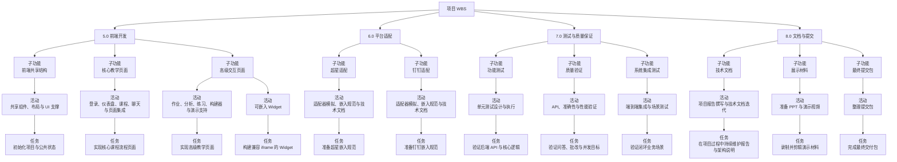
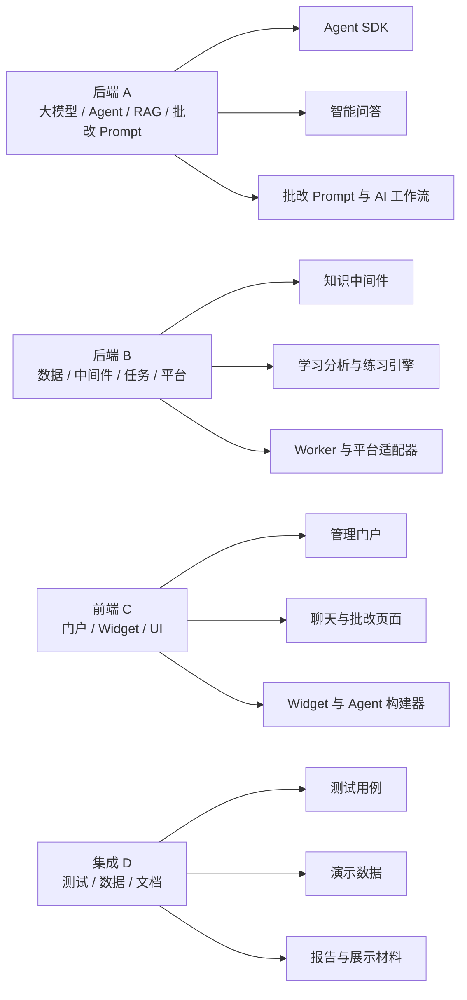
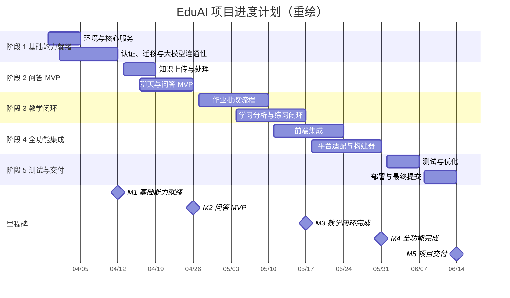
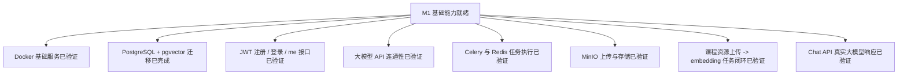

# EduAI RBS / WBS / 进度计划图

本文档用于重绘项目的 `RBS`、`WBS` 和 `Schedule` 图示，面向课程作业与阶段汇报使用。

## 1. 需求分解结构（RBS）

```mermaid
flowchart TB
    R0[项目目标与解决方案<br/>将 EduAI 建设为可嵌入多课程场景的 AI 教学平台]

    R0 --> RF[功能性需求]
    R0 --> RN[非功能性需求]
    R0 --> RC[约束条件]

    RF --> R1[需求 1<br/>统一 AI Agent 能力]
    R1 --> R11[功能<br/>Agent SDK]
    R11 --> R111[子功能<br/>AgentBase 与角色模板]
    R111 --> R1111[特性<br/>可复用的问答 / 批改 / 练习 Agent 模板]
    R1 --> R12[功能<br/>大模型集成]
    R12 --> R121[子功能<br/>多供应商模型接入]

    RF --> R2[需求 2<br/>知识处理与检索]
    R2 --> R21[功能<br/>知识中间件]
    R21 --> R211[子功能<br/>文档摄取]
    R211 --> R2111[特性<br/>PDF / Word / PPT 内容提取]
    R21 --> R212[子功能<br/>向量存储与索引]
    R21 --> R213[子功能<br/>混合检索]

    RF --> R3[需求 3<br/>教学互动与问答]
    R3 --> R31[功能<br/>智能问答]
    R31 --> R311[子功能<br/>多轮对话]
    R311 --> R3111[特性<br/>基于会话的上下文连续性]
    R31 --> R312[子功能<br/>结合课程上下文回答]

    RF --> R4[需求 4<br/>作业批改与批注]
    R4 --> R41[功能<br/>作业批改]
    R41 --> R411[子功能<br/>多模态批改]
    R4 --> R42[功能<br/>批注反馈]
    R42 --> R421[子功能<br/>教师风格的行内评语]
    R421 --> R4211[特性<br/>用于反馈渲染的结构化批注输出]

    RF --> R5[需求 5<br/>学习分析与练习支持]
    R5 --> R51[功能<br/>学习分析]
    R51 --> R511[子功能<br/>掌握度分析与预警]
    R5 --> R52[功能<br/>个性化练习生成]
    R52 --> R521[子功能<br/>面向薄弱点的练习支持]
    R521 --> R5211[特性<br/>测评-批改-练习闭环支持]

    RF --> R6[需求 6<br/>平台嵌入与管理]
    R6 --> R61[功能<br/>平台适配]
    R61 --> R611[子功能<br/>超星与钉钉嵌入]
    R6 --> R62[功能<br/>Agent 可视化构建器]
    R62 --> R621[子功能<br/>教师端可视化配置]
    R621 --> R6211[特性<br/>拖拽式 Agent 定制]

    RN --> R71[非功能需求 N1<br/>性能与准确性]
    R71 --> R711[功能<br/>并发访问支持]
    R71 --> R712[功能<br/>问答与批改质量目标]
    R712 --> R7121[特性<br/>问答与批改准确率 >= 95%]

    RN --> R72[非功能需求 N2<br/>安全与架构]
    R72 --> R721[功能<br/>基于角色的访问控制]
    R72 --> R722[功能<br/>可复用的模块化架构]
    R722 --> R7221[特性<br/>跨课程复用的 SDK 架构]

    RC --> R81[约束 1<br/>主要大模型]
    R81 --> R811[特性<br/>以通义千问作为主要模型]
    RC --> R82[约束 2<br/>平台范围]
    R82 --> R821[特性<br/>仅实现模拟平台集成]
    RC --> R83[约束 3<br/>时间范围]
    R83 --> R831[特性<br/>项目于 2026-06-14 前交付]
```

## 2. 工作分解结构（WBS）- 第 1 部分

```mermaid
flowchart TB
    W0[项目 WBS]

    W0 --> W1[1.0 项目管理]
    W1 --> W11[子功能<br/>项目协调]
    W11 --> W111[活动<br/>启动与跟踪]
    W111 --> W1111[任务<br/>完成项目章程与每周进度控制]
    W11 --> W112[活动<br/>风险处理]
    W112 --> W1121[任务<br/>解决阻塞问题并协调团队]

    W0 --> W2[2.0 需求与系统设计]
    W2 --> W21[子功能<br/>需求定义]
    W21 --> W211[活动<br/>编写 RBS 并确认范围]
    W211 --> W2111[任务<br/>最终确定需求集合]
    W2 --> W22[子功能<br/>架构与数据表设计]
    W22 --> W221[活动<br/>设计系统架构]
    W221 --> W2211[任务<br/>确认模块边界]
    W22 --> W222[活动<br/>设计数据库 Schema]
    W222 --> W2221[任务<br/>确认数据模型与关系]
    W2 --> W23[子功能<br/>接口与 UI 设计]
    W23 --> W231[活动<br/>定义 API 契约]
    W231 --> W2311[任务<br/>编写路由规格说明]
    W23 --> W232[活动<br/>绘制页面线框图]
    W232 --> W2321[任务<br/>准备 UI 草图]

    W0 --> W3[3.0 基础设施与 DevOps]
    W3 --> W31[子功能<br/>本地环境搭建]
    W31 --> W311[活动<br/>配置 Docker Compose]
    W311 --> W3111[任务<br/>启动 postgres、redis 和 minio]
    W31 --> W312[活动<br/>运行 Alembic 迁移]
    W312 --> W3121[任务<br/>生成并应用数据库结构]
    W3 --> W32[子功能<br/>运行时服务]
    W32 --> W321[活动<br/>配置 Celery 与 Redis]
    W321 --> W3211[任务<br/>验证任务队列执行]
    W32 --> W322[活动<br/>配置 MinIO]
    W322 --> W3221[任务<br/>验证对象存储访问]
    W3 --> W33[子功能<br/>部署配置]
    W33 --> W331[活动<br/>云端部署与 Nginx]
    W331 --> W3311[任务<br/>准备部署脚本与反向代理]

    W0 --> W4[4.0 后端开发]
    W4 --> W41[子功能<br/>核心基础能力]
    W41 --> W411[活动<br/>认证与数据模型]
    W411 --> W4111[任务<br/>JWT 认证与用户角色]
    W41 --> W412[活动<br/>种子数据准备]
    W412 --> W4121[任务<br/>准备初始用户与课程数据]
    W4 --> W42[子功能<br/>Agent 与 AI 能力]
    W42 --> W421[活动<br/>Agent SDK 与大模型集成]
    W421 --> W4211[任务<br/>实现 AgentBase 与供应商适配层]
    W4 --> W43[子功能<br/>知识中间件]
    W43 --> W431[活动<br/>文档解析与向量嵌入]
    W431 --> W4311[任务<br/>存储分块与向量]
    W4 --> W44[子功能<br/>教学智能引擎]
    W44 --> W441[活动<br/>批改、分析与练习逻辑]
    W441 --> W4411[任务<br/>构建批改与学习分析流程]
    W4 --> W45[子功能<br/>RESTful API 路由]
    W45 --> W451[活动<br/>实现路由分组]
    W451 --> W4511[任务<br/>交付 8 组 API 路由]
```

## 3. 工作分解结构（WBS）- 第 2 部分

## 4. 预计工作量

### 4.1 模块级汇总

| WBS | 模块 | 预计工时 | 主要负责人 |
| :--- | :--- | ---: | :--- |
| 1.0 | 项目管理 | 24 | 全体成员 |
| 2.0 | 需求与系统设计 | 40 | 全体成员 |
| 3.0 | 基础设施与 DevOps | 32 | 后端 A / 后端 B |
| 4.0 | 后端开发 | 120 | 后端 A / 后端 B |
| 5.0 | 前端开发 | 96 | 前端 C / 集成 D |
| 6.0 | 平台适配 | 16 | 集成 D / 后端 B |
| 7.0 | 测试与质量保证 | 40 | 集成 D（牵头）/ 全体成员 |
| 8.0 | 文档与提交 | 32 | 集成 D / 全体成员 |
|  | **总工时** | **400** |  |

### 4.2 面向进度安排的任务级估算

| WBS | 任务 / 工作包 | 预计工时 | 建议负责人 |
| :--- | :--- | ---: | :--- |
| 1.1 | 完成项目章程与每周进度控制 | 16 | 全体成员 |
| 1.2 | 解决阻塞问题并协调团队 | 8 | 全体成员 |
| 2.1 | 最终确定需求集合 | 8 | 全体成员 |
| 2.2 | 确认模块边界 | 12 | 全体成员 |
| 2.3 | 确认数据模型与关系 | 8 | 后端 A / 后端 B |
| 2.4 | 编写路由规格说明 | 8 | 后端 A / 后端 B |
| 2.5 | 准备 UI 草图 | 4 | 前端 C |
| 3.1 | 启动 postgres、redis 和 minio | 8 | 后端 A |
| 3.2 | 生成并应用数据库结构 | 4 | 后端 A |
| 3.3 | 验证任务队列执行 | 8 | 后端 B |
| 3.4 | 验证对象存储访问 | 4 | 后端 B |
| 3.5 | 准备部署脚本与反向代理 | 8 | 后端 A / 后端 B |
| 4.1 | JWT 认证与用户角色 | 10 | 后端 A |
| 4.2 | 准备初始用户与课程数据 | 10 | 后端 B |
| 4.3 | 实现 AgentBase 与供应商适配层 | 16 | 后端 A |
| 4.4 | 实现问答 / 批改 / 练习 Agent 能力 | 16 | 后端 A |
| 4.5 | 存储分块与向量 | 12 | 后端 B |
| 4.6 | 构建批改与学习分析流程 | 16 | 后端 A / 后端 B |
| 4.7 | 交付 Auth / Courses API | 6 | 后端 B |
| 4.8 | 交付 Agents / Assignments API | 6 | 后端 A / 后端 B |
| 4.9 | 交付 Chat / Analytics API | 6 | 后端 A / 后端 B |
| 4.10 | 交付 Exercises / Platform API | 6 | 后端 B |
| 4.11 | 资源上传与异步处理闭环 | 8 | 后端 B |
| 4.12 | 问答闭环集成 | 8 | 后端 A |
| 5.1 | 初始化项目与公共状态 | 8 | 前端 C / 集成 D |
| 5.2 | 实现登录、仪表盘、课程与聊天页面 | 32 | 前端 C / 集成 D |
| 5.3 | 实现作业、分析、练习与构建器页面 | 40 | 前端 C |
| 5.4 | 构建兼容 iframe 的 Widget | 16 | 前端 C / 集成 D |
| 6.1 | 准备超星嵌入规范 | 8 | 集成 D |
| 6.2 | 准备钉钉嵌入规范 | 8 | 集成 D |
| 7.1 | 后端 / API 逻辑单元测试设计与执行 | 14 | 集成 D |
| 7.2 | API、问答、批改与并发验证 | 14 | 集成 D |
| 7.3 | 端到端集成与闭环场景验证 | 12 | 全体成员 |
| 8.1 | 项目报告撰写与迭代更新 | 12 | 全体成员 |
| 8.2 | 录制并剪辑演示材料 | 8 | 集成 D |
| 8.3 | 完成最终交付包 | 12 | 集成 D |

## 5. 责任映射

## 6. 项目进度计划与里程碑

## 7. 当前进展对齐

