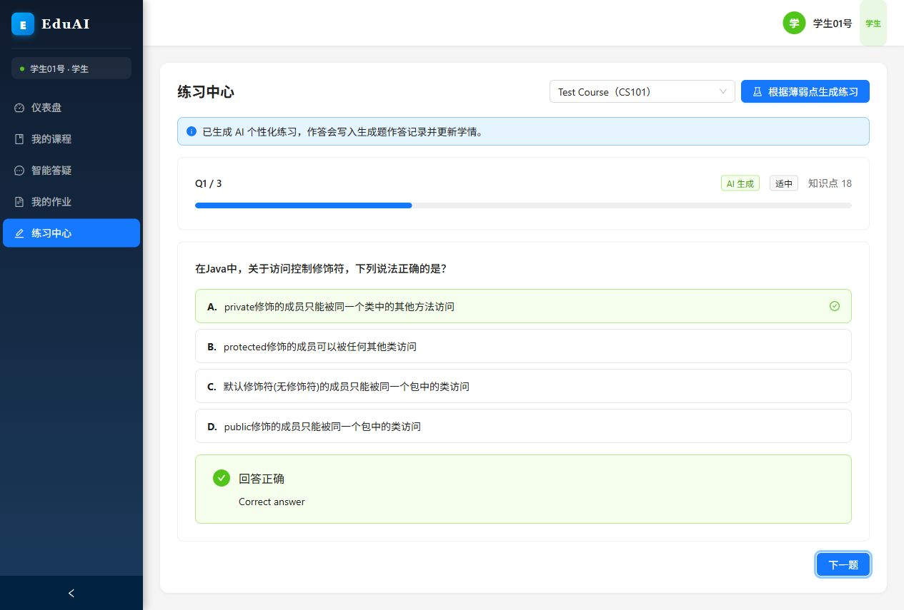

# M3 End-to-End Test Record

Date: 2026-05-26
Tester: Codex
Environment: local Docker infrastructure + local backend + local Vite frontend

## Scope

Milestone M3 verifies the teaching loop:

1. Student logs in.
2. Student opens Exercise Center.
3. Frontend calls `POST /api/v1/exercises/generate`.
4. Backend generates personalized exercises from student learning state and knowledge points.
5. Generated exercises are written into `generated_exercises`.
6. Student submits an answer with `generated_exercise_id`.
7. Backend writes attempt data, updates `student_knowledge_mastery`, and refreshes `learning_alerts`.

## Preconditions

- Docker services started: PostgreSQL, Redis, MinIO.
- Alembic migration applied with `alembic upgrade head`.
- Demo seed data loaded with `python seed.py`.
- Backend health check passed at `GET /health`.
- Frontend production build passed with `npm run build`.

## Test Account

| Role | Username | Password |
| --- | --- | --- |
| Student | `student_01` | `123456` |

## API Test Result

Command flow:

1. `POST /api/v1/auth/login`
2. `GET /api/v1/courses`
3. `POST /api/v1/exercises/generate`
4. `POST /api/v1/exercises/attempt`

Observed result:

| Field | Value |
| --- | --- |
| student user id | `8` |
| course id | `1` |
| course code | `CS101` |
| generated exercise count | `3` |
| generation source | `generated` |
| generation method | `llm` |
| first generated exercise id | `3` |
| attempt id | `19` |
| attempt correctness | `true` |
| attempt score | `100.0` |

Database verification after the flow:

| Table / Record Type | Count |
| --- | ---: |
| `generated_exercises` | `5` |
| `exercise_attempts` | `19` |
| `student_knowledge_mastery` | `11` |
| `learning_alerts` | `8` |

## Frontend Test Result

Verified in browser at `http://localhost:5173/exercises/1`:

- Exercise Center displays the `根据薄弱点生成练习` button.
- Clicking the button calls the generation interface.
- AI generated exercises replace the current question list.
- The question source tag displays `AI 生成`.
- Submitting an answer uses the generated exercise flow and displays grading feedback.

Screenshot:

## Demo Data Backup

Demo database backup:

`data/backups/m3-demo-data-2026-05-26.sql`

## Conclusion

M3 teaching-loop verification passed locally. The implemented flow covers frontend generation entry, real LLM generation, generated exercise persistence, generated-exercise answer submission, mastery update, and learning-alert refresh.
